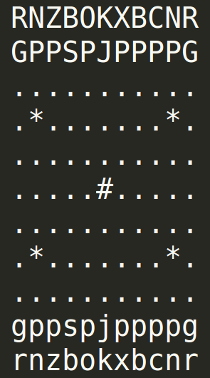

# Wildebeest 2 Player Chess AI
> A chess variant alpha-beta pruning AI.

[Wildebeest chess](https://en.wikipedia.org/wiki/Wildebeest_Chess) is a chess variant orginaly created by R. Wayne Schmittberger where the board is 11x10 sqaures. The board consists of the standard chess pieces along with a couple new pieces whose moveset, after effects and rules can be found in the table below. In addition, there are a few special squares on the board which are detailed further down below in another table.

###Starting State of the Board


<br>
###Pieces Information 
| Chess Piece                | Moveset  | After Effects  |
| -------------------------- | -------  | ---------------|
| (P/p) pawn                 | Moves and capture likes a regular chess pawn except the en passant capture move is not allowed. | If any pawn occupies the row 5 (the middle of the board), the opposing player's golf cart becomes fully charged. |
| (B/b)                      | The bishop moves and captures like in regular chess. | n/a |
| (N/n)                      | The knight moves and captures like in regular chess. | n/ a |
| (R/r)                      | The rook moves and captures like in regular chess. | n/a |
| (S/s) Serpent              | The serpents moves likes a king however it cannot capture an opposing piece. | The serpent poisons enemy peices as described in the poison section below. |
| (O/o) Old Woman            | The old woman moves and captures like a king. | The Old Woman can be converted into a Grand Empress by the poisoning of an adjacent friendly piece see the description of poison below. |
| (E/e) Grand Empress        | The grand Empress moves and captures like a knight, queen and serpent. | The grand empress poisons enemy pieces as described in the poison section below. |
| (J/j) Prince Joey | Prince Joey moves and captures like a king. | If at any point in time, the total number of pieces (including Prince Joey) in Prince Joey’s row is evenly divisible by 5, prince Joey explodes and he, and any adjacent (8-square) pieces (friendly or enemy are removed from the board). If there are two Prince Joey’s in the same row, the determination of whether each Prince Joey explodes should be performed once, prior to the explosion(s) and removal of pieces. |
| (C/c) Catapult             | The catapult moves like a king however it cannot catpure an opposing piece. In addition, it can fling a friendly adjacent piece (8-square) from the piece’s starting position to a location that is in the same direction as the direction from the adjacent piece to the catapult. See more information about the flinged piece in the special section below. | n/ a |
| (G/g) Gorilla              | The gorilla moves like a king however it cannot capture an opposing peice (unless flung), nor can it **be** captured. It does, however, have the ability to push a piece (as long as that piece is not also a Gorilla). It this case, the Gorilla moves into an adjacent square (8-square) occupied by a friendly or opposing piece and that friendly or opposing piece also moves a single square in the same direction as the Gorilla. If the destination square of the pushed piece is not occupied by another Gorilla, then the occupant of the adjacent square is captured (even if it is a friendly piece). | n/a |
| (X/x) Golf cart            | The Golf Cart can only move and capture left and right a single square in the bottom and top row. | If the golf cart is charged after a turn, it additionally moves up or down the column capturing all pieces in the column (including friendly pieces and gorilla). If both golf carts are in the same column and are both charged everything in that column is removed. |
| (H/h) Time Machine         | The time machine cannot move or capture. | As long as the time machine is on the board, the golf cart is charged. |
| (Z/z) Beekerper            | The beekeeper moves and captures like a king. | Paralyzes any opoosing adjacent pieces (8 squares) and prevents them from moving by releasing a swarm. A piece can move through the swarmed space or into the swarmed space, but once landed in the swarmed space it will not be able to move. |
| (W/w) King with a Jet Pack | Moves and captures like a bishop. | n/a |

<br>
###Special Board Squares
|Sqaure Symbol | Effect |
|--------------| -------|
|(#) Jet Pack  | If a King lands on the Jeb Pack it becomes a King with a Jet Pack (W/w) (see Above). |
|(*) Transporter Pad | There are 4 transporter pads located on the board which teleport pieces to another transporter. The rules for the transporter pads are: <br><br> a. Row 3, Column 9 moves to Row 3, Column 1, (right to left) <br> b. Row 7, Column 1 moves to Row 3, Column 9, (diagonal right) <br>c. Row 7, Column 9 moves to Row 7, Column 1, (right to left) <br>d. Row 3, Column 1 moves to Row 7, Column 9. (diagonal right) |

<br>
### Poison
The Serpent has the ability to poison any opposing, biological, adjacent piece (8-square). Any time it is adjacent to one or more opposing biological, pieces, the opposing, biological pieces are all removed from the board (friendly pieces are unaffected).
<br>
* __1.__ If the Serpent ever poisons a piece that is also adjacent (8-square) to an opposing Old Woman, then the Serpent is captured (removed from the board) and the Old Woman piece is replaced by the Grand Empress piece. All opposing pieces next to the Serpent’s position are still removed.
<br>
* __2.__ The Serpent can poison an opposing Old Woman (if it is directly adjacent). The serpent can poison a gorilla.
<br>
* __3.__ If two serpents are adjacent to each other they will poison each other. If a friendly old woman is adjacent to a serpent that is poisoned by an enemy serpent, then the friendly old woman is converted into a Grand Empress.
<br>
* __4.__ The Golf Cart and Time Machine, cannot be poisoned (and cannot be used to convert the old woman into the Grand Empress).
<br>
* __5.__ A Serpent can poison an adjacent Beekeeper, but cannot move out of its swarm.

<br>
### Flung Pieces

## Installation

OS X & Linux:

```sh
git clone https://github.com/AGontcharov/Wildebeest-2-Player-Chess-AI.git
cd WildebeestChessAI
./AlphaBeta.py boards.txt
```

Windows:

```sh
Not yet available
```

## Usage example

## Meta

Alexander Gontcharov – alexander.goncharov@gmail.com

[https://github.com/AGontcharov/github-link](https://github.com/AGontcharov/)
